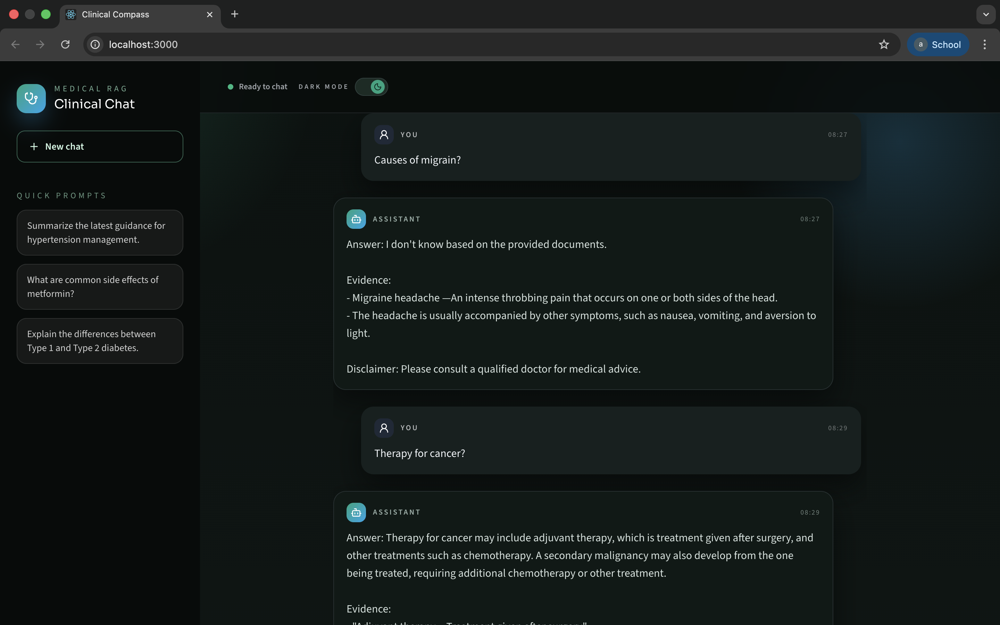

# Medical RAG Chatbot

Evidence-grounded medical Q and A over your own PDFs with a clean RAG pipeline,
a production-friendly backend, and a modern chat UI.

## Demo Preview


## Demo Video
<video src="Demo.mp4" controls></video>
If your viewer does not render the video, use this link: [Demo.mp4](Demo.mp4)

## Highlights
- Retrieval-first answers with citations pulled from your PDFs.
- End-to-end pipeline: ingestion, embeddings, vector search, LLM inference, UI.
- Ready for deployment with Docker and Jenkins hooks.

## What it does
- Loads medical PDFs from `data/`
- Splits and embeds text using `sentence-transformers/all-MiniLM-L6-v2`
- Stores and retrieves context from FAISS at `vectorstore/db_faiss`
- Generates answers via Hugging Face Inference Providers (chat completion)
- Serves a React chat UI and a Flask API

## Architecture
1) PDFs -> 2) Chunking -> 3) Embeddings -> 4) FAISS -> 5) Retrieval -> 6) LLM -> 7) UI

## Tech Stack
- Backend: Flask, LangChain, FAISS
- Embeddings: SentenceTransformers
- LLM: Hugging Face Inference Providers (configurable model)
- Frontend: React + Tailwind
- CI/CD: Jenkins, Trivy, AWS ECR/App Runner hooks

## Quickstart (local)

### Backend
```bash
python -m venv .venv
source .venv/bin/activate  # Windows: .venv\Scripts\activate
pip install -r requirements.txt

export HF_TOKEN="your_huggingface_token"

# Build the vectorstore from your PDFs
python app/components/data_loader.py

# Run the backend (defaults to 5001)
python app/application.py
```
Backend runs at `http://localhost:5001`.

### Frontend
```bash
npm install
```

Set `REACT_APP_API_URL` in `.env` (example in `.env.example`):
```
REACT_APP_API_URL=http://localhost:5001
```

Then start the UI:
```bash
npm start
```
Frontend runs at `http://localhost:3000`.

## Configuration
Key environment variables:
- `HF_TOKEN`: Hugging Face token (required)
- `HUGGINGFACEHUB_API_TOKEN`: optional alias for HF token
- `HUGGINGFACE_REPO_ID`: model id (default in `app/config/config.py`)
- `REACT_APP_API_URL`: backend URL for the frontend
- `HF_PROVIDER`: inference provider (default: `hf-inference`)
- `HF_MAX_TOKENS`, `HF_TEMPERATURE`, `HF_TOP_P`, `HF_TIMEOUT`: LLM settings
- `FLASK_SECRET_KEY`: session secret (set in production)

## Docker
```bash
docker build -t medical-rag .

# Build the vectorstore inside a container
docker run --rm -it \
  -e HF_TOKEN="your_huggingface_token" \
  -v "$(pwd)/data:/app/data" \
  -v "$(pwd)/vectorstore:/app/vectorstore" \
  medical-rag \
  python app/components/data_loader.py

# Run the app
docker run --rm -p 5001:5001 \
  -e HF_TOKEN="your_huggingface_token" \
  -v "$(pwd)/vectorstore:/app/vectorstore" \
  medical-rag
```

## Repo Layout
- `app/`: Flask app and RAG components
- `src/`: React frontend
- `data/`: PDF sources
- `vectorstore/`: FAISS index output
- `Dockerfile`: container build
- `Jenkinsfile`: CI/CD pipeline

## Notes
- This project is for information retrieval and demo purposes only.
- It does not provide medical advice; consult a qualified professional.
