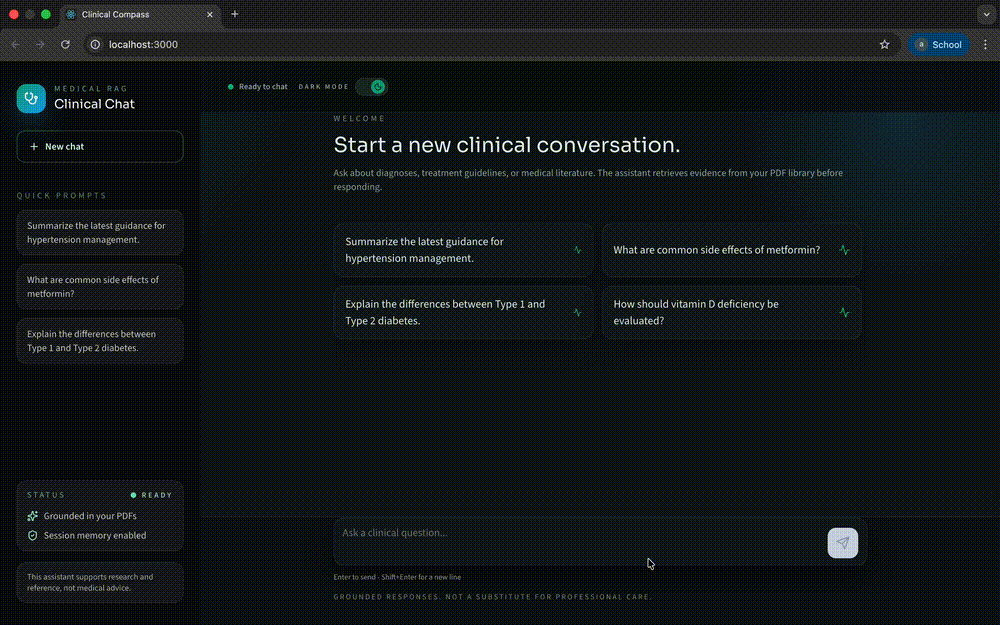
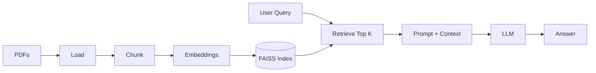
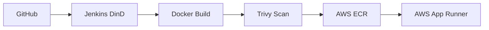

# Medical RAG Chatbot — LLMOps CI/CD (Jenkins + Trivy + AWS ECR + App Runner)

Production-style **Retrieval-Augmented Generation (RAG)** chatbot for medical PDFs with an end-to-end **CI/CD** pipeline: Docker build → Trivy scan → ECR push → AWS App Runner deploy via Jenkins (DinD).

## Demo



**Full demo video:** _add your link here_ (e.g., GitHub Release asset / YouTube / Drive)

## Architecture & Flow

### RAG flow



### CI/CD flow



> Optional: If you prefer a screenshot-style diagram, add `assets/architecture.png` and embed it here.

## Tech Stack

- **Backend:** Python, Flask
- **RAG:** LangChain + FAISS
- **Embeddings:** SentenceTransformers
- **LLM:** Hugging Face Inference Providers (configurable model)
- **Frontend:** React + Tailwind
- **Security:** Trivy
- **CI/CD:** Jenkins Pipeline (True DinD)
- **Registry:** AWS ECR
- **Deployment:** AWS App Runner

## Repository Structure

```text
.
├── app/                      # backend application code
├── data/                     # PDFs / knowledge base
├── vectorstore/db_faiss/     # FAISS index (generated)
├── src/                      # React frontend
├── public/                   # React static assets
├── custom_jenkins/           # Jenkins DinD Dockerfile
│   └── Dockerfile
├── Jenkinsfile               # CI/CD pipeline
├── Dockerfile                # app Dockerfile
└── README.md
```

## Local Setup

```bash
git clone https://github.com/data-guru0/LLMOPS-2-TESTING-MEDICAL.git
cd LLMOPS-2-TESTING-MEDICAL
```

Create venv + install:

```bash
python -m venv venv
source venv/bin/activate     # mac/linux
# venv\Scripts\activate      # windows

pip install -e .
```

### Backend

```bash
export HF_TOKEN="your_huggingface_token"

# Build the vectorstore from your PDFs
python app/components/data_loader.py

# Run the backend (defaults to 5001)
python app/application.py
```

Backend runs at `http://localhost:5001`.

### Frontend

```bash
npm install
```

Set `REACT_APP_API_URL` in `.env` (example in `.env.example`):

```env
REACT_APP_API_URL=http://localhost:5001
```

Start the UI:

```bash
npm start
```

Frontend runs at `http://localhost:3000`.

## Configuration

Key environment variables:

- `HF_TOKEN`: Hugging Face token (required)
- `HUGGINGFACE_REPO_ID`: model id (default in `app/config/config.py`)
- `HF_PROVIDER`: inference provider (default: `hf-inference`)
- `HF_MAX_TOKENS`, `HF_TEMPERATURE`, `HF_TOP_P`, `HF_TIMEOUT`: LLM settings
- `FLASK_SECRET_KEY`: session secret (set in production)
- `REACT_APP_API_URL`: backend URL for the frontend

## Docker

```bash
docker build -t medical-rag .

# Build the vectorstore inside a container
docker run --rm -it \
  -e HF_TOKEN="your_huggingface_token" \
  -v "$(pwd)/data:/app/data" \
  -v "$(pwd)/vectorstore:/app/vectorstore" \
  medical-rag \
  python app/components/data_loader.py

# Run the app
docker run --rm -p 5001:5001 \
  -e HF_TOKEN="your_huggingface_token" \
  -v "$(pwd)/vectorstore:/app/vectorstore" \
  medical-rag
```

## Jenkins Setup (True Docker-in-Docker)

### 1) Build Jenkins DinD image

```bash
cd custom_jenkins
docker build -t jenkins-dind .
```

### 2) Run Jenkins DinD container

```bash
docker run -d \
  --name jenkins-dind \
  --privileged \
  --restart unless-stopped \
  -p 8080:8080 -p 50000:50000 \
  -v jenkins_home:/var/jenkins_home \
  -v docker_dind:/var/lib/docker \
  jenkins-dind
```

### 3) Get admin password

```bash
docker exec -it jenkins-dind cat /var/jenkins_home/secrets/initialAdminPassword
```

Open Jenkins: `http://localhost:8080`.

## Install Tools in Jenkins Container (if missing)

### Install Trivy (ARM64-safe)

```bash
docker exec -u root -it jenkins-dind bash
apt-get update -y
apt-get install -y curl ca-certificates

curl -LO https://github.com/aquasecurity/trivy/releases/download/v0.62.1/trivy_0.62.1_Linux-ARM64.deb
dpkg -i trivy_0.62.1_Linux-ARM64.deb || apt-get -f install -y
trivy --version
exit
```

### Install AWS CLI (ARM64-safe)

```bash
docker exec -u root -it jenkins-dind bash
apt-get update -y
apt-get install -y unzip curl

curl "https://awscli.amazonaws.com/awscli-exe-linux-aarch64.zip" -o "awscliv2.zip"
unzip -q awscliv2.zip
./aws/install
aws --version
exit
```

## Jenkins + GitHub Integration

1) Create a GitHub token (classic) with scopes: `repo`, `admin:repo_hook`
2) Add to Jenkins Credentials:
   - Jenkins → Manage Jenkins → Credentials → (Global) → Add Credentials
   - Kind: Username with password
   - Username: your GitHub username
   - Password: GitHub token
   - ID: `github-token`

## AWS Setup (ECR + App Runner)

### IAM User permissions

Attach these policies to your Jenkins IAM user:

- `AmazonEC2ContainerRegistryFullAccess`
- `AWSAppRunnerFullAccess`

### Add AWS creds to Jenkins

- Jenkins → Credentials → Add
- Kind: AWS Credentials
- ID: `aws-token` (matches your Jenkinsfile)

## CI/CD Pipeline (Jenkinsfile)

This repo contains a `Jenkinsfile` that performs:

- Checkout source from GitHub
- Docker build
- Trivy scan (artifact: `trivy-report.json`)
- Push image to AWS ECR
- Trigger AWS App Runner deployment

See `Jenkinsfile` for the full pipeline definition.

## Security Notes

- Trivy typically uses `--severity HIGH,CRITICAL`.
- If your pipeline uses `|| true`, the build does **not** fail on findings.

To fail the pipeline on vulnerabilities:

```bash
trivy image --severity HIGH,CRITICAL --exit-code 1 ...
```

## Troubleshooting

### Jenkins container restart loop: volume permission issue

Fix once:

```bash
docker rm -f jenkins-dind

docker run --rm \
  -v jenkins_home:/var/jenkins_home \
  --user root \
  jenkins/jenkins:lts \
  bash -lc "chown -R 1000:1000 /var/jenkins_home && ls -ld /var/jenkins_home"
```

### Docker daemon not reachable inside Jenkins

```bash
docker exec -it jenkins-dind docker info
docker exec -it jenkins-dind docker run --rm hello-world
```

## Live Demo

Add your App Runner service URL here.

## License

MIT (or your preferred license)

## Disclaimer

This project is for information retrieval and demo purposes only. It does not provide medical advice; consult a qualified professional for medical decisions.
