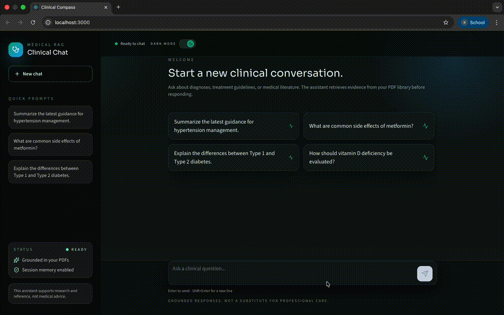
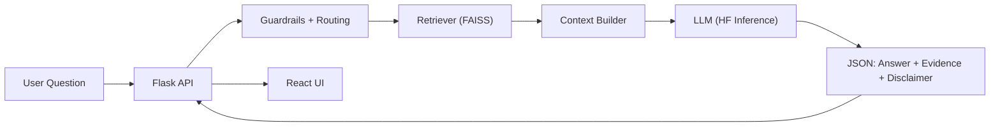
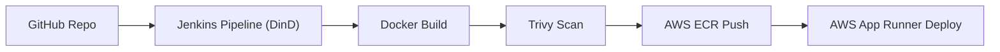
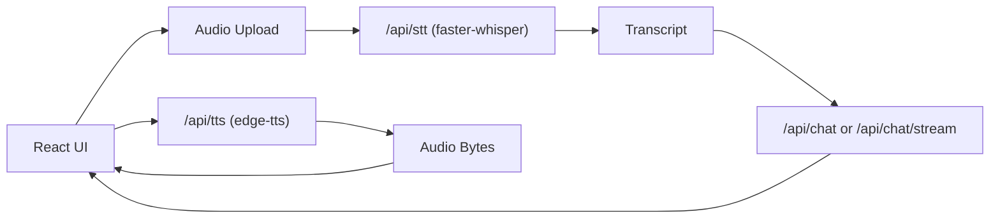

# Medical RAG Chatbot - LLMOps CI/CD (Jenkins, Trivy, AWS ECR, App Runner)

Production-style Retrieval-Augmented Generation (RAG) chatbot for medical PDFs with an end-to-end CI/CD pipeline: Docker build -> Trivy scan -> ECR push -> App Runner deploy via Jenkins (Docker-in-Docker). Optional voice support (STT/TTS) is available via faster-whisper and Edge TTS.

## Features

- RAG over local medical PDFs with FAISS retrieval.
- Router supports pdf, web (optional), and hybrid paths.
- Evidence-aware responses with disclaimers for safety.
- Streaming endpoint for low-latency responses.
- Optional voice layer (STT/TTS) for audio input and spoken output.
- CI/CD pipeline with security scanning and automated deploy.

## Demo



Full demo video: add link

## Architecture

### RAG + Serving


```mermaid
flowchart LR
  U["User Question"] --> API["Flask API"];
  API --> GR["Guardrails + Routing"];
  GR --> RET["Retriever (FAISS)"];
  RET --> CTX["Context Builder"];
  CTX --> LLM["LLM (HF Inference)"];
  LLM --> OUT["JSON: Answer + Evidence + Disclaimer"];
  OUT --> API;
  API --> UI["React UI"];
```

### CI/CD Pipeline


```mermaid
flowchart LR
  GH["GitHub Repo"] --> JK["Jenkins Pipeline (DinD)"];
  JK --> DB["Docker Build"];
  DB --> TV["Trivy Scan"];
  TV --> ECR["AWS ECR Push"];
  ECR --> AR["AWS App Runner Deploy"];
```

### Optional Voice Flow


```mermaid
flowchart LR
  UI["React UI"] --> UP["Audio Upload"];
  UP --> STT["/api/stt (faster-whisper)"];
  STT --> TXT["Transcript"];
  TXT --> CHAT["/api/chat or /api/chat/stream"];
  CHAT --> UI;
  UI --> TTS["/api/tts (edge-tts)"];
  TTS --> AUD["Audio Bytes"];
  AUD --> UI;
```

## Tech Stack

- Backend: Python, Flask
- RAG: LangChain + FAISS
- Embeddings: sentence-transformers
- LLM: Hugging Face Inference Providers (model configurable)
- Frontend: React + Tailwind
- Security: Trivy
- CI/CD: Jenkins Pipeline (Docker-in-Docker)
- Registry: AWS ECR
- Deployment: AWS App Runner
- Voice (optional): faster-whisper (STT) + edge-tts (TTS)

## Repository Structure

```
.
├── app/                      # Flask backend + RAG components
├── data/                     # PDFs / knowledge base
├── vectorstore/db_faiss/     # FAISS index (generated)
├── src/                      # React frontend
├── public/                   # React static assets
├── custom_jenkins/           # Jenkins DinD Dockerfile
│   └── Dockerfile
├── Jenkinsfile               # CI/CD pipeline
├── Dockerfile                # App Dockerfile
└── README.md
```

## Quick Start (Local)

### Prerequisites

- Python and pip
- Node.js and npm
- Hugging Face token
- Optional: Docker for containerized runs

### Setup

1) Clone

```bash
git clone https://github.com/data-guru0/LLMOPS-2-TESTING-MEDICAL.git
cd LLMOPS-2-TESTING-MEDICAL
```

2) Create venv and install

```bash
python -m venv venv
source venv/bin/activate     # mac/linux
# venv\Scripts\activate      # windows

pip install -e .
```

3) Create `.env` in the repo root (no spaces around `=`)

```bash
HF_TOKEN=hf_your_token_here
HUGGINGFACE_REPO_ID=Qwen/Qwen2.5-7B-Instruct
DEFAULT_ROUTE=hybrid

REACT_APP_API_URL=http://localhost:5001

# Optional (web search routing)
TAVILY_API_KEY=tvly_your_key_here

# Optional (reranker)
CROSS_ENCODER_MODEL=cross-encoder/ms-marco-MiniLM-L6-v2

# Optional (voice)
EDGE_TTS_VOICE=en-IN-PrabhatNeural
```

If you accidentally committed keys earlier, rotate them.

4) Build vector store (PDF ingestion)

Put PDFs in `data/`, then run:

```bash
python app/components/data_loader.py
```

5) Run backend

```bash
python app/application.py
```

Backend: http://localhost:5001

6) Run frontend

```bash
npm install
npm start
```

Frontend: http://localhost:3000

## API Endpoints

### Chat

- POST `/api/chat`

```json
{ "question": "What is hypertension?", "route": "pdf" }
```

- POST `/api/chat/stream` (streams plain text chunks)

Routes allowed:

- pdf: only PDFs
- web: only web (if enabled)
- hybrid: router decides or combines

### Voice (Optional)

- POST `/api/stt` (multipart form-data)
  - key: `audio`
  - returns: `{ "text": "...", "language": "...", "duration": ... }`
- POST `/api/tts`

```json
{
  "text": "Hello, how can I help?",
  "voice": "en-IN-PrabhatNeural",
  "rate": "+10%",
  "pitch": "+10Hz",
  "output_format": "audio-24khz-48kbitrate-mono-mp3"
}
```

Returns: audio bytes

- GET `/api/voice/voices` (list voices for dropdown)

## Docker (App)

```bash
docker build -t medical-rag .
```

Build the vectorstore inside a container:

```bash
docker run --rm -it \
  -e HF_TOKEN="your_huggingface_token" \
  -v "$(pwd)/data:/app/data" \
  -v "$(pwd)/vectorstore:/app/vectorstore" \
  medical-rag \
  python app/components/data_loader.py
```

Run the app:

```bash
docker run --rm -p 5001:5001 \
  -e HF_TOKEN="your_huggingface_token" \
  -v "$(pwd)/vectorstore:/app/vectorstore" \
  medical-rag
```

## Jenkins Setup (Docker-in-Docker)

1) Build Jenkins DinD image

```bash
cd custom_jenkins
docker build -t jenkins-dind .
```

2) Run Jenkins DinD container

```bash
docker run -d \
  --name jenkins-dind \
  --privileged \
  --restart unless-stopped \
  -p 8080:8080 -p 50000:50000 \
  -v jenkins_home:/var/jenkins_home \
  -v docker_dind:/var/lib/docker \
  jenkins-dind
```

3) Get admin password

```bash
docker exec -it jenkins-dind cat /var/jenkins_home/secrets/initialAdminPassword
```

Open Jenkins: http://localhost:8080

### Install Tools in Jenkins Container (if missing)

Trivy (ARM64-safe)

```bash
docker exec -u root -it jenkins-dind bash
apt-get update -y
apt-get install -y curl ca-certificates

curl -LO https://github.com/aquasecurity/trivy/releases/download/v0.62.1/trivy_0.62.1_Linux-ARM64.deb
dpkg -i trivy_0.62.1_Linux-ARM64.deb || apt-get -f install -y
trivy --version
exit
```

AWS CLI (ARM64-safe)

```bash
docker exec -u root -it jenkins-dind bash
apt-get update -y
apt-get install -y unzip curl

curl "https://awscli.amazonaws.com/awscli-exe-linux-aarch64.zip" -o "awscliv2.zip"
unzip -q awscliv2.zip
./aws/install
aws --version
exit
```

## Jenkins + GitHub Integration

1) Create a GitHub token (classic) with scopes: repo, admin:repo_hook
2) Add to Jenkins credentials:
   - Jenkins -> Manage Jenkins -> Credentials -> (Global) -> Add Credentials
   - Kind: Username with password
   - Username: your GitHub username
   - Password: GitHub token
   - ID: github-token

## AWS Setup (ECR + App Runner)

### IAM User Permissions

Attach these to your Jenkins IAM user:

- AmazonEC2ContainerRegistryFullAccess
- AWSAppRunnerFullAccess

### Add AWS creds to Jenkins

- Jenkins -> Credentials -> Add
- Kind: AWS Credentials
- ID: aws-token (must match your Jenkinsfile)

## CI/CD Pipeline (Jenkinsfile)

This repo contains a Jenkinsfile that typically performs:

- Checkout source
- Docker build
- Trivy scan (artifact: trivy-report.json)
- Push image to AWS ECR
- Trigger AWS App Runner deployment

See `Jenkinsfile` for the complete pipeline.

## Troubleshooting

### Vector store rebuild

To recreate FAISS from scratch:

```bash
rm -rf vectorstore/db_faiss
python app/components/data_loader.py
```

Warning: "Normalizing L2 is not applicable for COSINE"

This warning is usually safe. It appears when FAISS settings and normalization mismatch. If results look bad, use a consistent metric (cosine requires normalized vectors).

### Jenkins restart loop (volume permission issue)

Fix once:

```bash
docker rm -f jenkins-dind

docker run --rm \
  -v jenkins_home:/var/jenkins_home \
  --user root \
  jenkins/jenkins:lts \
  bash -lc "chown -R 1000:1000 /var/jenkins_home && ls -ld /var/jenkins_home"
```

## Live Demo

Add your App Runner service URL here.

## Disclaimer

This project is for information retrieval and demo purposes only. It does not provide medical advice. Always consult a qualified professional for medical decisions.
